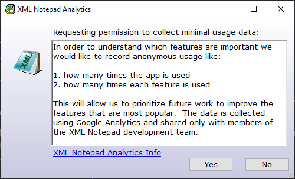

## Analytics

In order to understand which features are important XML Notepad records anonymous usage like:

1. how many times the app is used
2. how many times each feature is used (options, xslt, search, etc)

The data is collected using Google Analytics and shared only with members of the XML Notepad
development team. The data is used to prioritize future work to improve the features that are most
popular.

The first time you install XML Notepad on your computer you will be prompted with the following
dialog:



If you click `No` then the choice will be written to the XML Notepad settings file and it will not
be prompted again. Analytics can be enabled or disabled any time using the `Allow analytics` option
in the [Options dialog](options.md).

If you want to disable analytics before installing XML Notepad (perhaps in an enterprise wide
distribution) then you can create this file before running the installer:

```
%LOCALAPPDATA%\Microsoft\Xml Notepad\XmlNotepad.settings
```
containing the following:
```xml
<Settings>
  <AnalyticsClientId>disabled</AnalyticsClientId>
  <AllowAnalytics>False</AllowAnalytics>
</Settings>
```

This will disable analytics and avoid the first time prompt. The `disabled` option here for
`AnalyticsClientId` causes the `Analytics` option in the Options Dialog to be hidden so the user
cannot enable analytics later.
